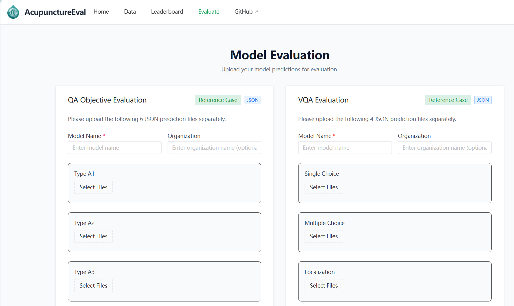
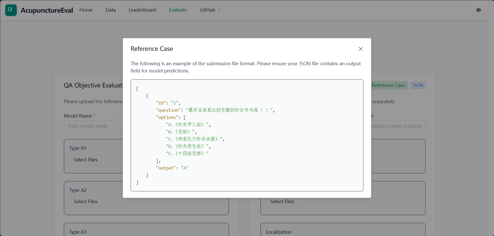

# AcupunctureEval

<div align="center">
    
</div>


<div align="center">

**Acupuncture/TCM Question Bank Evaluation & Leaderboard Platform**

[📃 Paper](https://openreview.net/forum?id=YyJBqE1ERp) • [🌐 Website](https://www.AcupunctureEval.daytime001.xin)

[中文](README_zh.md) | English

</div>

## 🌈 Updates

[2025.01.02] AcupunctureEval platform initialized, supporting multi-dimensional VQA and QA evaluation.

## 🌐 Download & Installation

It is recommended to use `git` to clone this project:

```bash
git clone "https://github.com/your-username/AcupunctureEval.git"
cd AcupunctureEval
```

## 🥇 Leaderboard

Please verify the latest model rankings on the official [Leaderboard](https://www.AcupunctureEval.daytime001.xin) after starting the service.

## 🥸 Dataset Introduction

### Components

The dataset of this project covers multiple knowledge dimensions in the field of Acupuncture and Traditional Chinese Medicine (TCM), aiming to comprehensively evaluate the professional capabilities of large models.


#### 1. QA (Text Question Answering) - AcupunctureQA
Comprehensive and multi-level evaluation of the model's TCM theoretical knowledge, containing three parts: objective questions, subjective questions, and case analysis:

- **Objective Questions**: A total of 1735 samples, sourced from textbooks.
  - **Covered Fields**: Meridians and Acupoints, Acupuncture and Moxibustion, TCM Diseases.
  - **Dataset Split**: Validation Set (1516) + Test Set (219).
  - **Question Types**: A1, A2, A3, A4, B, X types.
- **Subjective Questions**: A total of 45,962 question-answer pairs.
  - **Covered Fields**: Acupuncture (5205), Acupoints (12576), Moxibustion (644), Tuina (1416), TCM Syndromes, etc.
- **Case Analysis**: A total of 100 samples, covering 7 dimensions such as etiology and pathogenesis.

#### 2. VQA (Visual Question Answering) - AcupunctureVQA
Evaluates the model's multimodal understanding capabilities regarding acupuncture points, anatomical structures, and operational techniques, with a total of 10,729 samples:

- **Task Types**: Image Understanding and Image Reasoning.
- **Question Classification**:
  - **Single/Multiple Choice**: TCM diagnosis and identification based on images.
  - **Localization**: Precise identification of acupoints and body parts.
  - **Operation**: Visual question answering on acupuncture techniques and operation procedures.


#### 3. Video (Video Understanding) - AcupunctureVideo
A video dataset regarding practical acupuncture point operations, with a total of 1000 samples, divided into three categories:
1. **Standard Techniques**: Standard practical operation of acupuncture points on the human body by acupuncturists.
2. **Clinical Records**: Actual operation videos on patients by experts in real clinical scenarios.
3. **Animal Experiments**: Standard practical operation of acupuncture points on experimental pigs by acupuncturists.


### Data Examples

#### QA Item Example (Type A1)
```json
{
    "ID": "1",
    "question": "The earliest and relatively complete monograph on acupuncture and moxibustion is ( )",
    "options": [
        "A. The AB Classic of Acupuncture and Moxibustion",
        "B. Miraculous Pivot",
        "C. Essentials of Acupuncture and Moxibustion in the Bronze Man",
        "D. Classic of Nourishing Life with Acupuncture and Moxibustion",
        "E. Elucidation of the Fourteen Meridians"
    ],
}
```

#### VQA Item Example (Image Understanding)
```json
{
    "ID": "1",
    "Type": "Image Understanding",
    "Class": "Acupoints of Lung Meridian of Hand-Taiyin",
    "Images": [
        "Figure 3-2-2.jpeg"
    ],
    "Question": "Which acupoints in the options might be included in the image?",
    "Options": [
        "A. Lieque",
        "B. Yunmen",
        "C. Kongzui",
        "D. Jingqu"
    ],
}
```

## 🚀 Quick Start

This project contains a separated frontend and backend architecture: FastAPI Backend + Vue3 Frontend.

### 1) Backend Environment Configuration & Startup
```powershell
cd backend

# Create environment
conda create -n acue python=3.12
conda activate acue
pip install -r requirements.txt

# Initialize database
python init_db.py

# Start service
fastapi dev main.py
```
After startup, access API documentation: `http://127.0.0.1:8000/docs`

### 2) Frontend Environment Configuration & Startup
```powershell
cd frontend

# Install dependencies
npm install

# Start development server
npm run dev
```
After startup, access the page: `http://127.0.0.1:5173/`

## 📊 Evaluation Channel

We provide online evaluation submission methods:

1. **Web Interface Submission**: Upload the prediction result JSON file on the "Evaluation" page.


**Prediction File Format Description**:
- Please refer to the JSON structure in 'Reference Case'.
- Flat question types (A1/A2/X) submit array format.
- Grouped question types (A3/A4/B) need to include parent question ID and sub-question outputs.


## 📄 License

This project follows the [MIT License](LICENSE).
