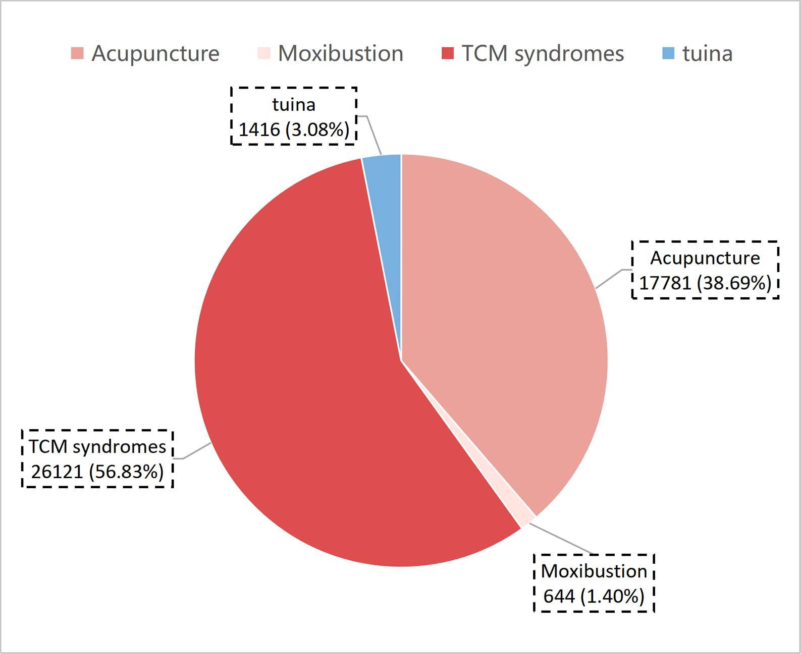
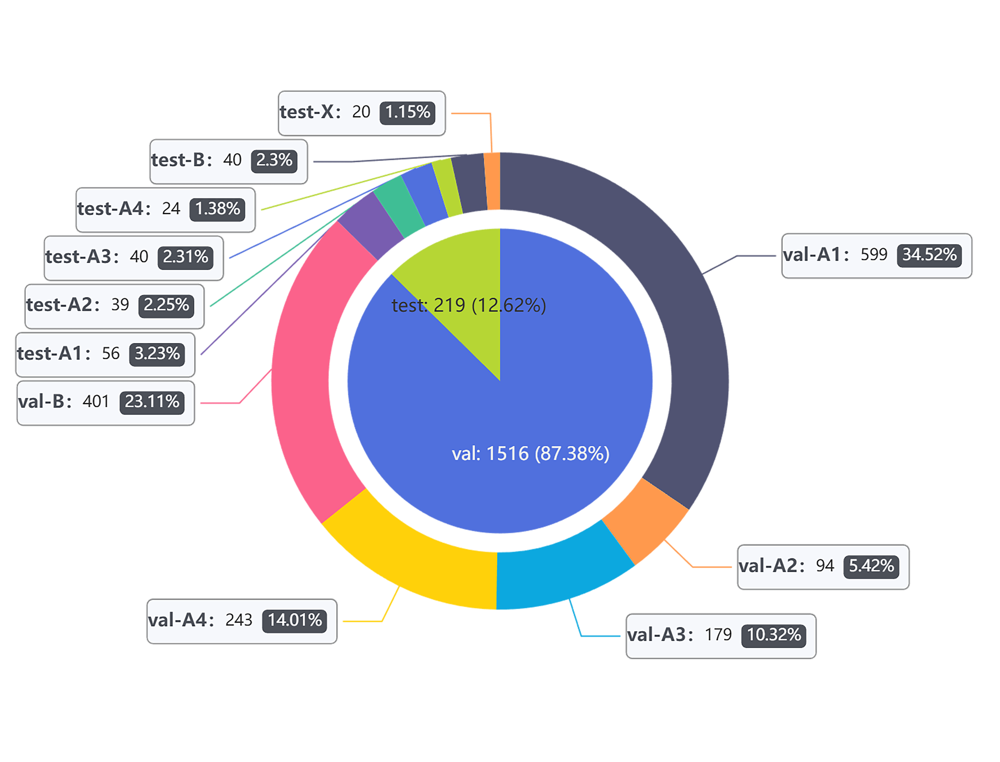
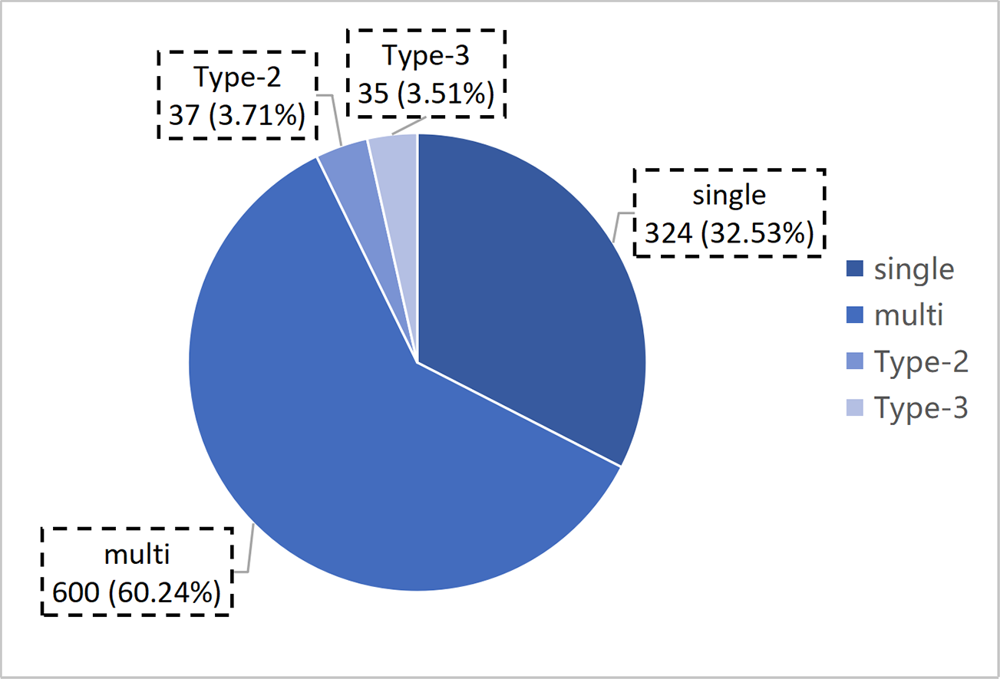
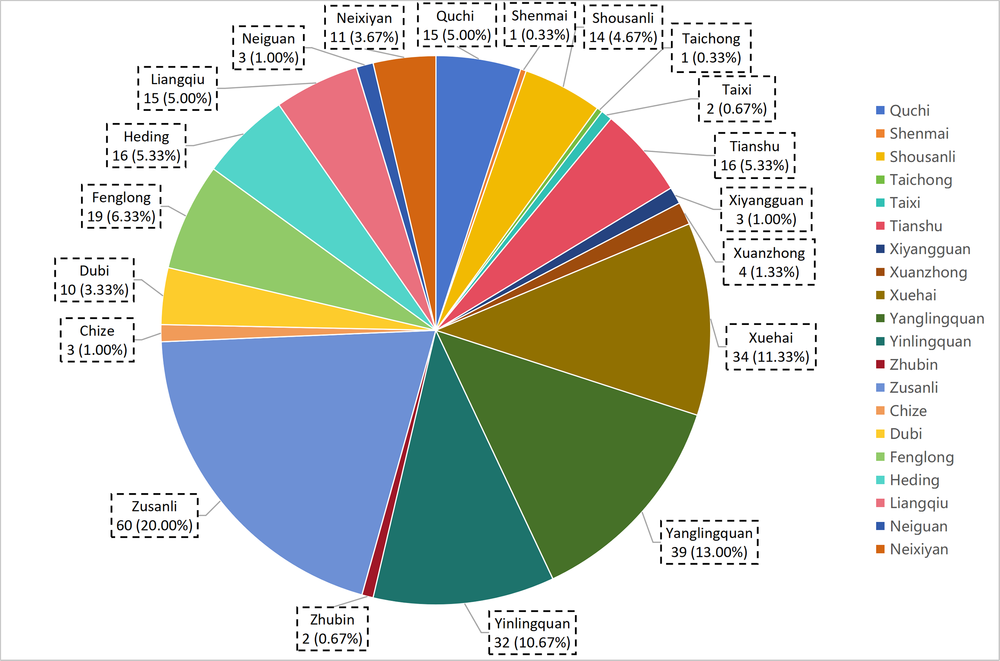
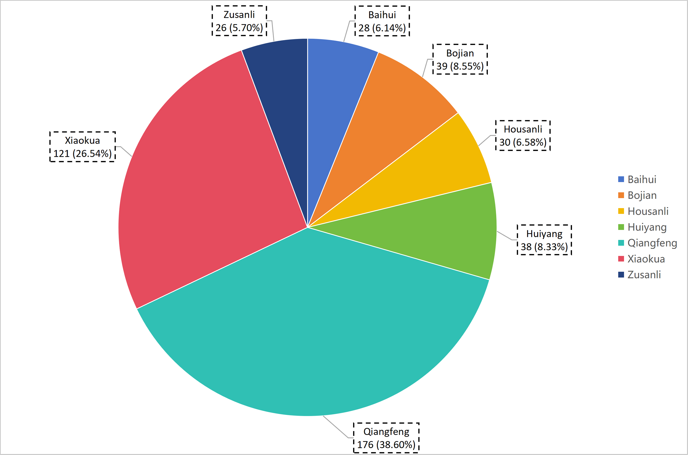
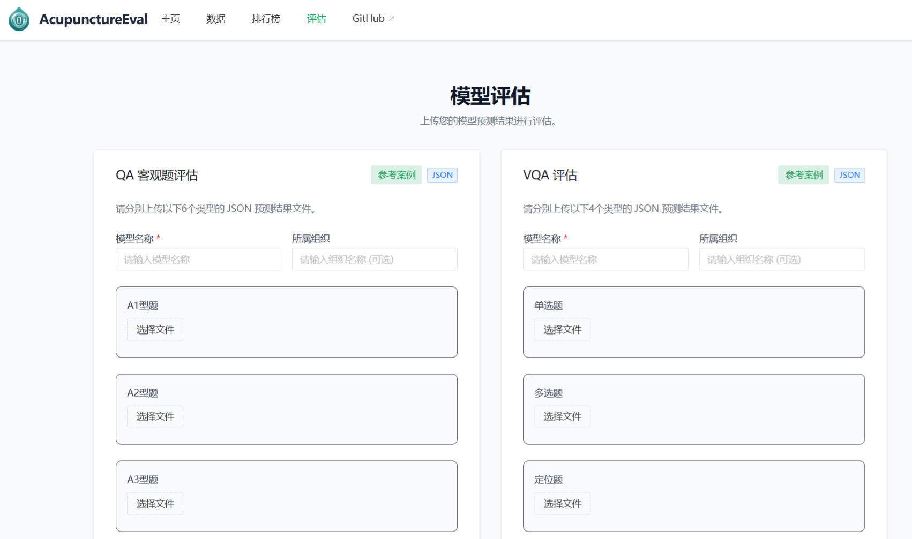
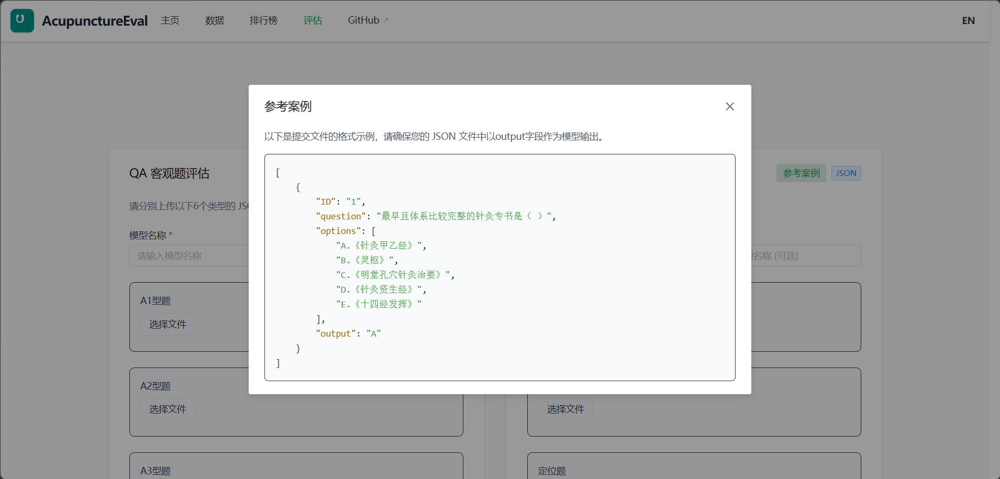

# AcupunctureEval

<div align="center">
    
</div>


<div align="center">

**Acupuncture Question Bank Evaluation & Leaderboard Platform**

[📃 Paper](https://openreview.net/forum?id=YyJBqE1ERp) • [🌐 Website](https://www.AcupunctureEval.daytime001.xin)

中文 | [English](README.md)

</div>

## 🌈 更新

[2025.01.02] AcupunctureEval平台初始化，支持 VQA 和 QA 多维度评测。

## 🌐 下载与安装

推荐使用 `git` 克隆本项目：

```bash
git clone "https://github.com/your-username/AcupunctureEval.git"
cd AcupunctureEval
```

## 🥇 排行榜

请启动服务后访问官网 [Leaderboard](https://www.AcupunctureEval.daytime001.xin/leaderboard) 查看最新模型排名。

## 🥸 数据集介绍

### 组成部分

本项目数据集涵盖中医针灸领域的多种知识维度，旨在全方位评估大模型的专业能力。




#### 1. QA (Text Question Answering) - AcupunctureQA
全方位多层次测评模型的中医理论知识，包含客观题、主观题和病例分析题三部分：

- **客观题 (Objective Questions)**: 共 1735 个样本，源自教科书。
  - **涵盖领域**: 经络腧穴、刺灸、中医病症。
  - **数据集划分**: 验证集 (1516) + 测试集 (219)。
  - **题型**: A1, A2, A3, A4, B, X 型题。
- **主观题 (Subjective Questions)**: 共 45,962 个问答对样本。
  - **涵盖领域**: 针灸 (5205)、穴位 (12576)、艾灸 (644)、推拿 (1416) 及中医证候等。
- **病例分析 (Case Analysis)**: 共 100 个样本，涵盖病因病机等 7 个维度。

#### 2. VQA (Visual Question Answering) - AcupunctureVQA
测评模型对针灸穴位、解剖结构及操作手法的多模态理解能力，共 10,729 个样本：

- **任务类型**: 图像理解 (Image Understanding) 与 图像推理 (Image Reasoning)。
- **题型分类**:
  - **单选题/多选题**: 基于图像的中医诊断与辨识。
  - **定位题 (Localization)**: 穴位与身体部位的精确定位识别。
  - **操作题 (Operation)**: 针灸手法与操作流程的视觉问答。




#### 3. Video (Video Understanding) - AcupunctureVideo
关于针灸穴位实践操作的视频数据集，共 1000 个样本，分为三类：
1. **标准手法**: 针灸师对人体针灸穴位的标准手法实践操作。
2. **临床实录**: 专家在真实临床场景下对患者的实际操作视频。
3. **动物实验**: 针灸师对实验猪针灸穴位的标准手法实践操作。


### 数据样例

#### QA Item Example (A1题型)
```json
{
    "ID": "1",
    "question": "最早且体系比较完整的针灸专书是（ ）",
    "options": [
        "A.《针灸甲乙经》",
        "B.《灵枢》",
        "C.《明堂孔穴针灸治要》",
        "D.《针灸资生经》",
        "E.《十四经发挥》"
    ],
}
```

#### VQA Item Example (图片理解)
```json
{
    "ID": "1",
    "Type": "Image Understanding",
    "Class": "手太阴腧穴",
    "Images": [
        "图3-2-2.jpeg"
    ],
    "Question": "图片中可能包含选项中的哪些穴位？",
    "Options": [
        "A. 列缺",
        "B. 云门",
        "C. 孔最",
        "D. 经渠"
    ],
}
```

## 🚀 快速开始

本项目包含前后端分离的架构：FastAPI 后端 + Vue3 前端。

### 1) 后端环境配置与启动
```powershell
cd backend

# 创建环境
conda create -n acue python=3.12
conda activate acue
pip install -r requirements.txt

# 初始化数据库
python init_db.py

# 启动服务
fastapi dev main.py
```
启动后访问 API 文档：`http://127.0.0.1:8000/docs`

### 2) 前端环境配置与启动
```powershell
cd frontend

# 安装依赖
npm install

# 启动开发服务器
npm run dev
```
启动后访问页面：`http://127.0.0.1:5173/`

## 📊 评测通道

我们提供了在线评测提交方式：

1. **Web 界面提交**：在“评测”页面上传预测结果 JSON 文件。


**预测文件格式说明**：
- 请参考‘参考案例’中的 JSON 结构。
- 扁平题型（A1/A2/X）提交数组格式。
- 分组题型（A3/A4/B）需包含父题 ID 和子题 outputs。

## 📄 License

本项目遵循 [MIT License](LICENSE)。
